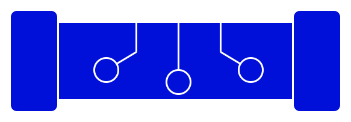

<h3 align="center"></h3>
<h3 align="center">FUSE Driver for Puter</h3>
<h4 align="center">Access Puter's cloud filesystem on your device</h4>

## Current Status

**under development**

## What's a FUSE?

Filesystem in USErspace (FUSE) is an interface for filesystem
drivers that are loaded as userspace programs rather than in
the kernel. It is available in most POSIX systems like Linux
and Mac OS.

Puter's FUSE driver allows access to a cloud filesystem in a
way that looks like an ordinary local filesystem.
